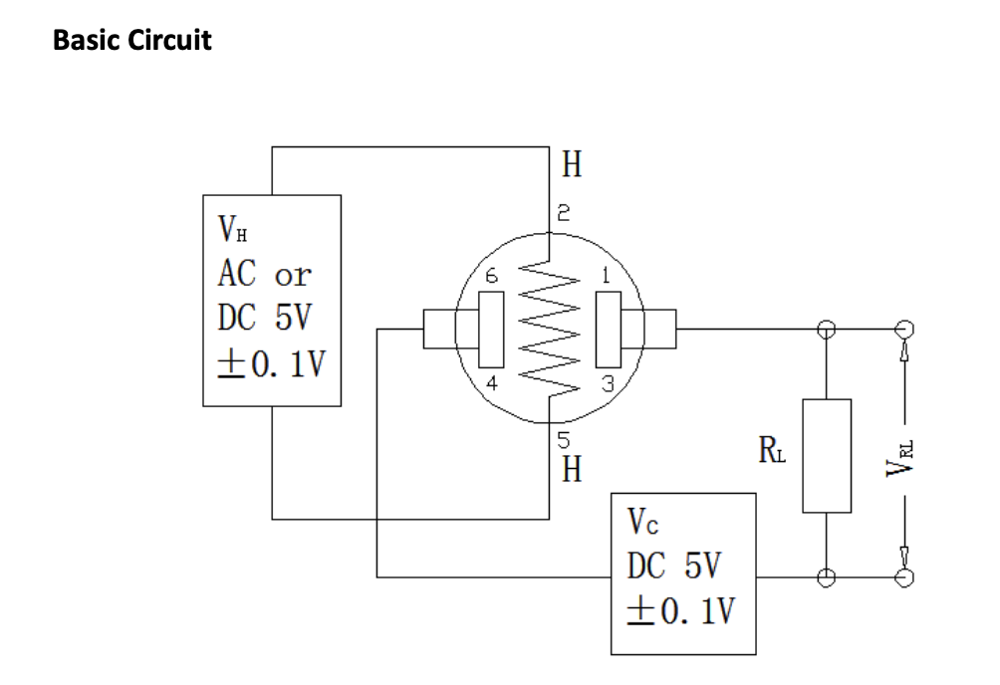
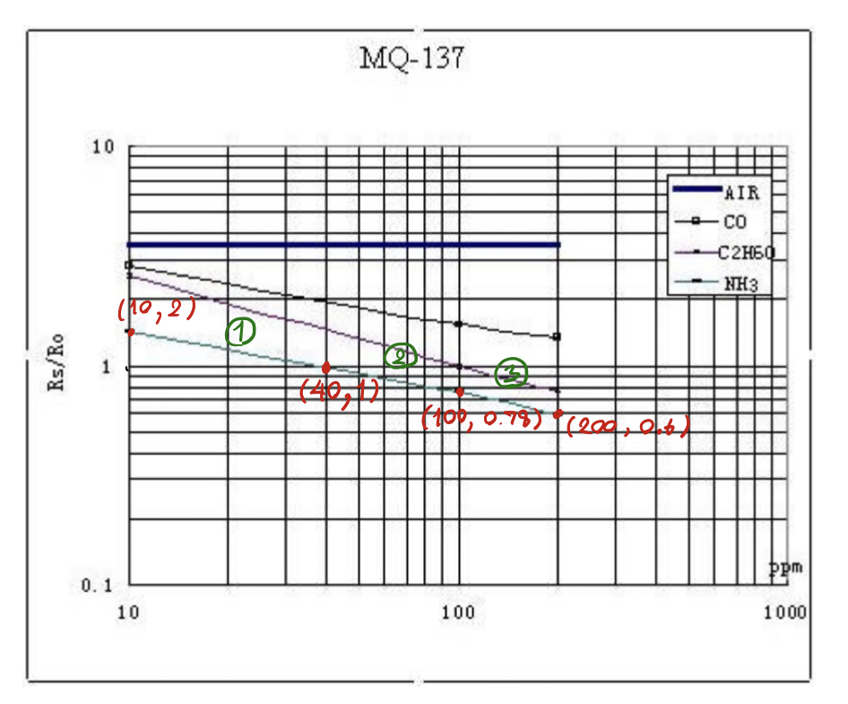
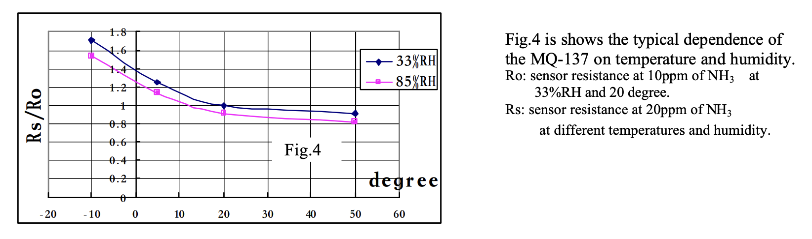
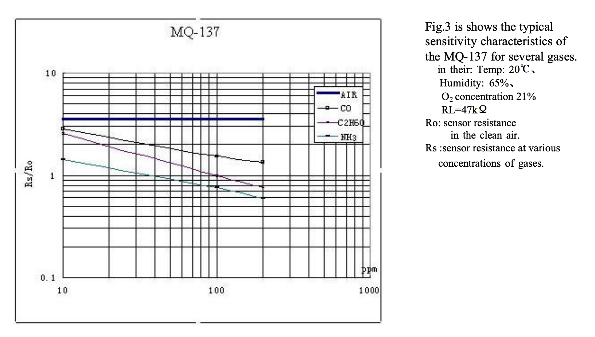
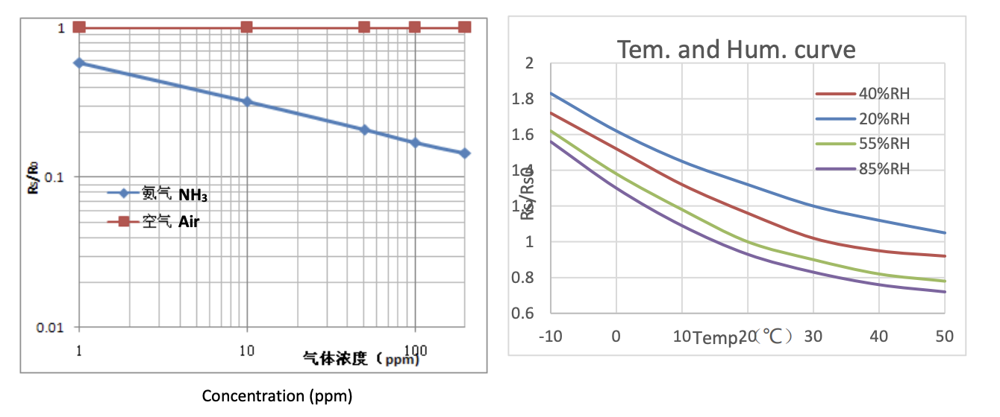
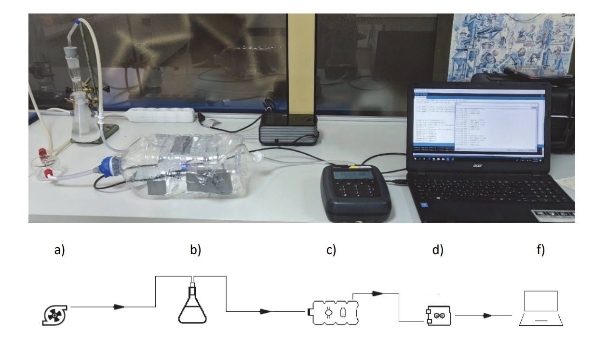

# MQ137
MQ-137 is a odor sensor  
there are 2 datasheets available on internet and you have to look into it carefully because the sensitive graphs are difference
* [Hanwei](https://datasheetspdf.com/pdf/904649/Hanwei/MQ137/1) (currently used)
* [Winsen](https://www.winsen-sensor.com/d/files/mq137-(ver1_6)---manual.pdf)

# Tutorial
* [Measuring PPM from MQ Gas Sensors using Arduino (Hanwei)](https://circuitdigest.com/microcontroller-projects/arduino-mq137-ammonia-sensor)
* [AMMONIA CONCENTRATION MONITORING USING ARDUINO PLATFORM (Winsen)](https://hrcak.srce.hr/file/325243)
* [Development of an ammonia portable low-cost air quality station (Winsen)](https://repositorio.ul.pt/bitstream/10451/40375/1/ulfc125577_tm_Ana_Margarida_Antunes.pdf)
* [Arduino MQ137 PPM Sensor (Unknown)](https://www.instructables.com/MQ137-PPM-Sensor/)

# Circuit


# How to calibrate MQ-137 (Finding R0)
From the circuit above, you can find 
```
VC = VS + VL
VC = I*RS + I*RL
VC = I (RS+RL)
VC/I = RS+RL
VC / (VRL/RL) = RS + RL
(VC * RL) / VRL = RS + RL
```
then
```
RS = ((VC*RL)/VRL) - RL
```
from the table below, in the fresh air the ratio (RS/R0) should be `3.6` (estimated).  
so we have to find the R0 using 3.6 and RS as the formula below, and from the datasheet the stable sensor should be heat by leaving it for 10 hrs.  
so I leaved it 1 night and got `8.68` as R0.
```
R0 = 3.6/RS
```


# How to find Part Per Million from MQ-137 (PPM)
After receiving R0 we can now find the ratio using the formula below
```
ratio = RS/R0
```
and from the ratio, we can now find PPM from it using the graph above.  
I separated it into 3 linear graph as you can see the formula below.
```
(1) log(ratio) = -0.5*log(ppm) + 0.801
(2) log(ratio) = -0.27116*log(ppm) + 0.4344
(2) log(ratio) = -0.37851*log(ppm) + 0.6491
```
**note** the numbers in formula are calculated by using the marked points shown in the graph above

#  How temperature and humidity relate to PPM
This is the multiplier of ratio depends on temperature and humidity, I seperated the graph into 3 parts using linear graph and separated by humidity (33% and 85%)
## For Humidity 33%
```
(1) ratio = -0.03167*temperature + 1.3833
(2) ratio = -0.015*temperature + 1.3
(2) ratio = -0.00333*temperature + 1.0667
```
## For Humidity 85%
```
(1) ratio = -0.027*temperature + 1.31
(2) ratio = -0.017*temperature + 1.26
(2) ratio = -0.00333*temperature + 0.98667
```



# Code

```c
#define RL 47  //The value of resistor RL is 47K

// value from https://www.instructables.com/MQ137-PPM-Sensor/
#define m -0.263 //Enter calculated Slope 
#define b 0.42 //Enter calculated intercept
#define Ro 8.68 //Enter found Ro value
#define MQ_sensor A0 //Sensor is connected to A4

// ppm and ratio graph (by MOS)
#define m1 -0.5
#define m2 -0.27116
#define m3 -0.37851
#define b1 0.801
#define b2 0.4344
#define b3 0.6491
#define ratio1 1
#define ratio2 0.78

// RH | temperature and ratio
// 33%
#define rh33 33
#define t33m1 -0.03167
#define t33m2 -0.015
#define t33m3 -0.00333
#define t33b1 1.3833
#define t33b2 1.3
#define t33b3 1.0667
#define t33ratio1 1.225
#define t33ratio2 1.0
// 85%
#define rh85 85
#define t85m1 -0.027
#define t85m2 -0.017
#define t85m3 -0.00333
#define t85b1 1.31
#define t85b2 1.26
#define t85b3 0.98667
#define t85ratio1 1.175
#define t85ratio2 0.92

void setup() { 
  Serial.begin(112500);
}

void findR0() {
  float sensor_volt;
  float RS_air; //sensor resistance
  float R0; //Unknown R0
  float sensorValue = 0;
  for (int x = 0 ; x < 500 ; x++) //loop
  {
    sensorValue = sensorValue + analogRead(MQ_sensor); //Add analog values of sensor 500 times
  }

  sensorValue = sensorValue / 500.0; //Average of the readings
  sensor_volt = sensorValue * (5.0 / 1023.0); //Transform to voltage
  RS_air = ((5.0 * RL) / sensor_volt) - RL; //Calculate RS for 0 ammonia amb
  
  // MQ137 for HANWEI
  // note: if it is winsen -> 1 instead of 3.6
  R0 = RS_air / (3.6);

  //Display values in serial
  Serial.print("R0 = ");
  Serial.println(R0);
  Serial.print("Rs_AIR = ");
  Serial.println(RS_air);
  delay(1000); //Wait a second
}

void findPPM() {
  float VRL = 0.0f; //Voltage drop across the MQ sensor
  float Rs = 0.0f; //Sensor resistance at gas concentration
  float ratio = 0.0f; //Define variable for ratio

  VRL = analogRead(MQ_sensor) * (5.0 / 1023.0); //Measure the voltage drop and convert to 0-5V
  Rs = ((5.0 * RL) / VRL) - RL; //Use formula to get Rs value

  // normal raitio at 20 degree 33% RH
  ratio = Rs / Ro; // find ratio Rs/Ro

  // todo: connect with temperature sensor here.
  float temperature = 16.0f;
  float rh = 40.0f;

  // find the multiplier for ratio
  float multipier = 1.0f;
  if (rh < rh85) {
    // use rh33% formular
    // find the multipier from current temperature
    if (ratio < t33ratio1) {
      multipier = (t33m1*temperature) + t33b1;
    } else if (ratio < t33ratio2) {
      multipier = (t33m2*temperature) + t33b3;
    } else {
      multipier = (t33m3*temperature) + t33b3;
    }
  } else {
    // use rh85% formular
    // find the multipier from current temperature
    if (ratio < t85ratio1) {
      multipier = (t85m1*temperature) + t85b1;
    } else if (ratio < t85ratio2) {
      multipier = (t85m2*temperature) + t85b3;
    } else {
      multipier = (t85m3*temperature) + t85b3;
    }
  }
  ratio *= multipier;
  
  // ppm calculated fomular from https://www.instructables.com/MQ137-PPM-Sensor/
  float ppm = pow(10, ((log10(ratio) - b) / m)); //use formula to calculate ppm

  // use the graph from HANWEI datasheet but I computed m and b my by self
  float mos_ppm = pow(10, ((log10(ratio) - b) / m)); //use formula to calculate ppm
  if (ratio < ratio1) {
    mos_ppm = pow(10, ((log10(ratio) - b1) / m1));
  } else if (ratio <= ratio2) {
    mos_ppm = pow(10, ((log10(ratio) - b2) / m2));
  } else {
    mos_ppm = pow(10, ((log10(ratio) - b3) / m3));
  }
  
  Serial.print("NH3 (ppm) = ");
  Serial.println(ppm);
  Serial.print("MOS|NH3 (ppm) = ");
  Serial.println(mos_ppm);
  Serial.print("Voltage = ");
  Serial.println(VRL);
  Serial.print("ratio = ");
  Serial.println(ratio);
  delay(1000);
}

void loop() {
  //  findR0();
  findPPM();
}
```

# Sensitive Characteristics of MQ-137
## Hanwei


## Winsen


# Comparing with Official Odor Sensor (OMX-ADM)
[this](https://kanomax.biz/asia/about/pdf/omx-adm_manual.pdf) odor sensor can measure ammonia PPM by computing ammonia intensity. the PPM value that it can handle is between 0-25 ppm and 2.5-5 intensity (1-40 ppm). you can convert the intensity to ppm using the graph right [here](https://www.city.gifu.lg.jp/_res/projects/default_project/_page_/001/003/184/kankei.pdf)

## How to compare
in order to compare the ppm and voltage, we need to build an environment to conduct it.


# Others
* [Review on MOS Gas Sensors based e-Noses and their Applications to Food Analysis](https://www.ijareeie.com/upload/2016/july/53_9_Review.pdf)
* [TGS 826](https://docs.rs-online.com/dded/0900766b815a66d9.pdf)
* [Ammonia - NH3 - Concentration in Air and Health Effects](https://www.engineeringtoolbox.com/ammonia-health-symptoms-d_901.html)